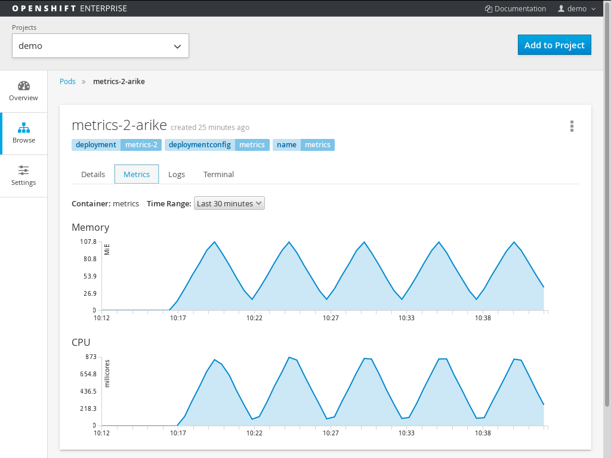

Usage
=====

```
$ oc create -f https://raw.githubusercontent.com/jim-minter/metrics/master/metrics.yaml
```

By default, a triangle wave of memory and CPU usage is generated with
wavelength (20 steps * **15s** =) 5 minutes and double amplitude of **100MB**
(memory) and 1 core (CPU).  The values in bold are configurable by modifying
the following environment variables:

- MAXMEM=100
- INTERVAL=15
